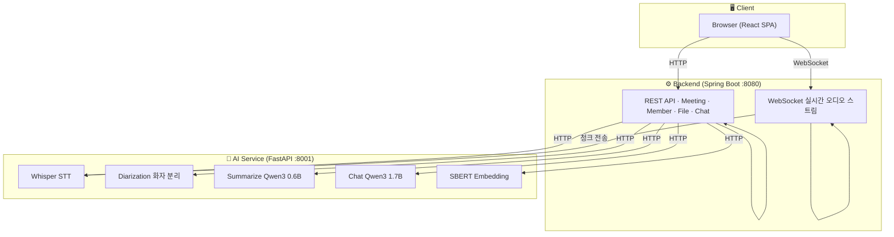
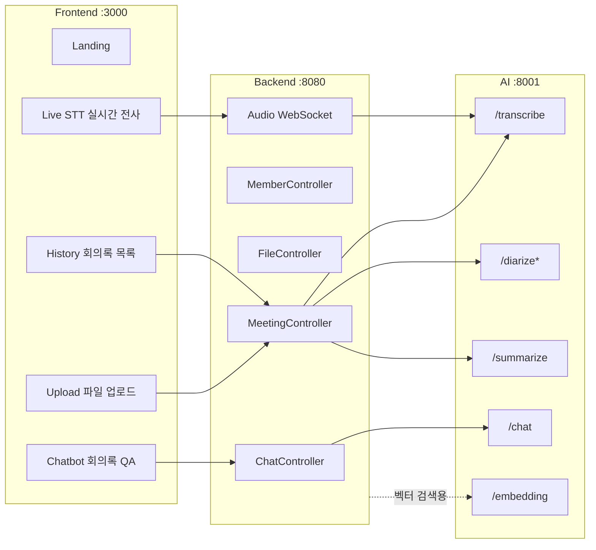
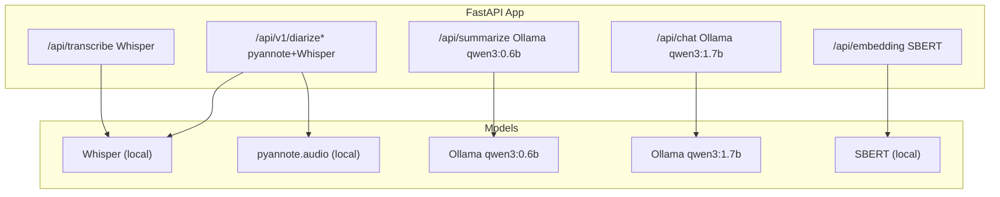

# AI Meeting Minutes

회의 음성/녹음을 업로드하거나 실시간으로 전사·화자 분리·요약하고, 회의록 기반 챗봇으로 질의할 수 있는 풀스택 웹 애플리케이션입니다.

---

## Tech Stack

| Layer | Stack |
|-------|--------|
| **Frontend** | React 18, TypeScript, Vite, React Router, Tailwind CSS |
| **Backend** | Spring Boot 3 (Java), WebSocket, JPA/H2 |
| **AI Service** | FastAPI, PyTorch, Whisper, pyannote (화자 분리), SBERT, Ollama (Qwen3) |

---

## System Architecture

### High-level overview



### Component & data flow



- `*` diarize: 화자 분리 + 전사 통합(`/diarize_and_transcribe`) 지원

### AI Service internal



---

## Features

- **업로드 기반 회의 처리**: 오디오/영상 업로드 → 전사 → 화자 분리 → 요약 → 회의록 저장
- **실시간 STT**: WebSocket으로 오디오 스트리밍 후 실시간 전사
- **회의록 히스토리**: 저장된 회의록 목록 조회 및 상세 보기
- **회의록 QA 챗봇**: 회의록 컨텍스트 기반 질의응답 (Qwen3 1.7B)
- **회원/인증**: 로그인·회원가입 (Backend Member API)

---

## Project Structure

```
AI-Mini/
├── frontend/          # React + Vite (port 3000)
│   └── src/
│       ├── landingPage, uploadPage, liveStt, historyPage
│       ├── chatbot, layout, sidebar, context
│       └── api, config, types, utils
├── backend/           # Spring Boot (port 8080)
│   └── src/main/java/com/minipr/backend/
│       ├── meeting, member, segment, embedding
│       ├── websocket, controller, service
│       └── BackendApplication.java
├── ai/                # FastAPI (port 8001)
│   └── app/
│       ├── api/       # chat, whisper, summarize, sbert, diarization routers
│       ├── services/
│       └── main.py
├── scripts/
│   └── start_dev.js   # concurrently: frontend + backend + ai
└── package.json       # npm run dev → 통합 실행
```

---

## Getting Started

### Prerequisites

- **Node.js** v18+ (frontend, 루트 스크립트)
- **Java 17+** (Backend)
- **Python 3.12** (AI 서비스)
- **Ollama** (Qwen3 로컬 추론)
- **GPU** (권장): VRAM 6GB+, RAM 16GB+ (Medium 모델 기준)

### 1. AI 서비스 (Python)

```bash
cd ai
conda create -n ai5-backend python=3.12
conda activate ai5-backend

# CUDA 12.4용 PyTorch (GPU 가속 권장)
pip install torch torchvision torchaudio --index-url https://download.pytorch.org/whl/cu124
pip install -r requirements.txt

# Ollama 모델
ollama pull qwen3:0.6b   # 요약
ollama pull qwen3:1.7b   # 챗봇
```

### 2. Frontend (Node.js)

```bash
cd frontend
npm install
# 개발 서버만 쓸 경우: npm run dev
```

### 3. 통합 실행 (권장)

루트에서 한 번에 실행:

```bash
npm install
npm run dev
```

- **Frontend**: http://localhost:3000  
- **Backend**: http://localhost:8080  
- **AI API**: http://localhost:8001  
- **API 문서**: http://localhost:8001/docs  

---

## Configuration

- **Frontend**: `frontend/src/config.ts` — `API_BASE_URL` (백엔드/프록시 주소). 로컬은 Vite proxy로 `/api` → `http://localhost:8080`.
- **Backend**: `backend/src/main/resources/application.properties` — `python.ai.url=http://127.0.0.1:8001` (AI 서비스 주소).

---

## Troubleshooting

| 현상 | 확인/조치 |
|------|-----------|
| CUDA 관련 오류 (e.g. `compute_type="int8"`) | `nvidia-smi`로 CUDA 12.x 확인. PyTorch는 CUDA 버전에 맞게 설치 |
| Ollama 연결 실패 | Ollama 서비스 실행 여부, `ollama list`로 모델 존재 확인 |
| CORS/API 호출 실패 | Backend CORS 설정, Frontend `config.ts`의 `API_BASE_URL` 및 Vite proxy 일치 여부 확인 |

---

## License

ISC
