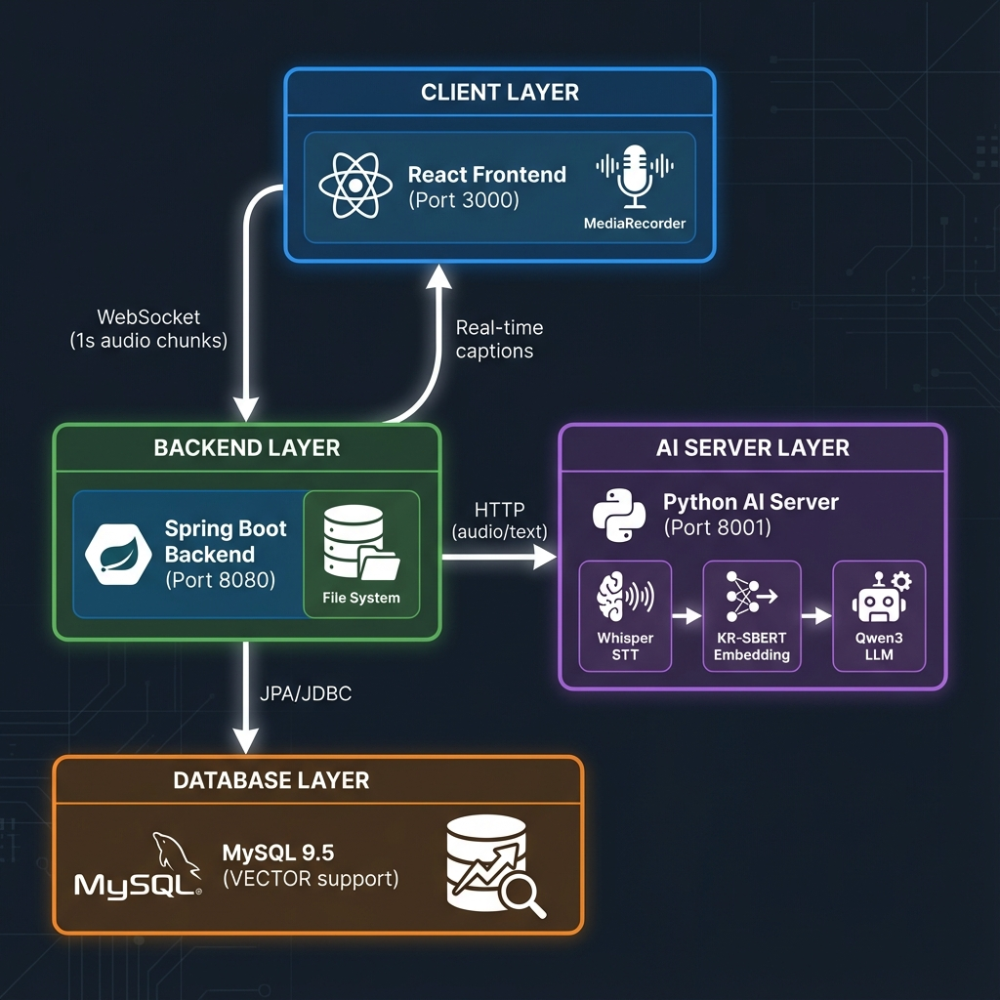
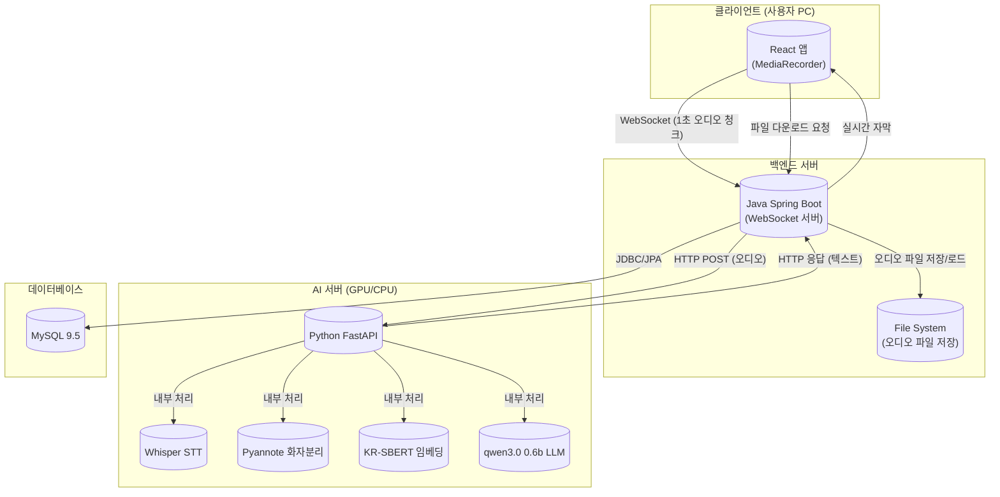
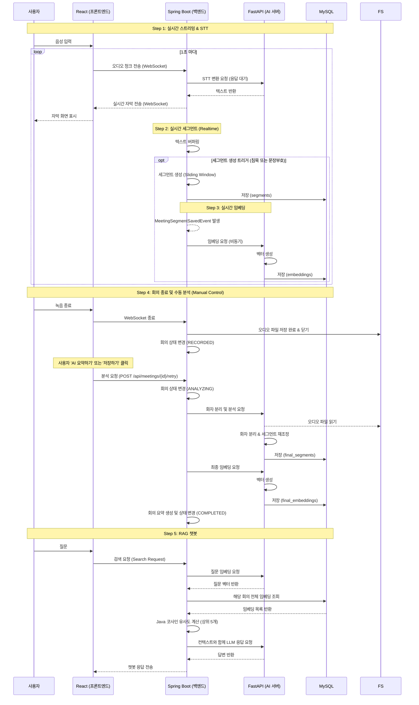
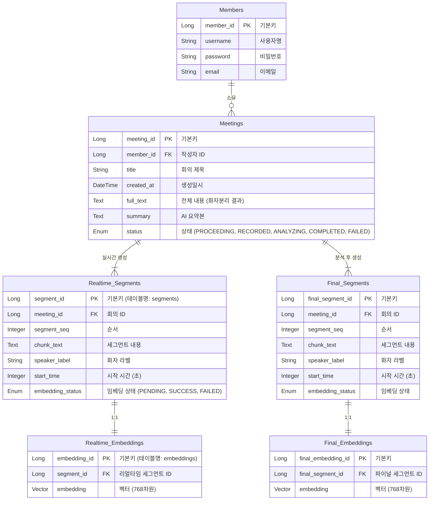

# 시스템 아키텍처 및 설계

이 문서는 AI 회의록 프로젝트의 시스템 아키텍처, 데이터 흐름, 그리고 데이터베이스 설계를 설명합니다.

> **💡 구현 현황 (2026-01-05)**
> - ✅ 실시간 스트리밍 & STT & 세그먼트 생성
> - ✅ 비동기 임베딩 (MySQL VECTOR 768차원)
> - ✅ RAG 챗봇 (Java 코사인 유사도 + Qwen3-0.6B)
> - ✅ 회의 히스토리 관리 및 전체 검색 (Global Search)
> - ✅ 화자 분리 및 최종 분석 (pyannote + Whisper 정밀 전사)
> - ✅ 파일 업로드 분석 (오디오 업로드 → 화자분리 → 요약 → 챗봇)
> - ✅ 실시간 녹음 수동 제어 (분석/요약/저장 수동 트리거)

## 1. 시스템 아키텍처 (System Architecture)

이 시스템은 React 프론트엔드, Java Spring Boot 백엔드, Python FastAPI AI 서버, 그리고 MySQL 데이터베이스로 구성됩니다.





---

## 2. 데이터 흐름 (Data Workflow)

### 실시간 스트리밍 & 처리 루프

1.  **스트리밍**: React가 오디오를 1초 단위로 수집하여 WebSocket으로 전송합니다.
2.  **STT (실시간 변환)**: Spring Boot가 이를 FastAPI(Whisper)로 전달하고, 변환된 텍스트를 받아 React로 반환합니다.
3.  **세그먼트 생성**: 반환된 텍스트는 Java 메모리 버퍼에 쌓이며, 문맥 유지를 위해 **30% 중첩(Overlap)**을 적용하여 세그먼트를 생성합니다.
4.  **저장 및 임베딩**: 생성된 세그먼트는 DB(`segments` 테이블)에 저장된 후, 비동기 이벤트로 임베딩(벡터화) 처리됩니다.



---

## 2.1. 트랜잭션 설계 (Transaction Design)

> **⚠️ 핵심 설계**: 긴 작업(AI 분석)과 DB 트랜잭션을 분리하여 **DB 커넥션 고갈 방지**

### 문제 상황
회의 종료 후 화자 분리 및 요약 생성은 30초~1분 이상 소요됩니다. 이 작업이 하나의 `@Transactional` 블록 안에 있으면:
- DB 커넥션을 장시간 점유 → 커넥션 풀(Pool) 고갈
- 다른 사용자 요청이 대기 → 서비스 멈춤

### 해결: 트랜잭션 쪼개기 (Split Transaction) & 수동 제어

- 실시간 녹음 종료 시에는 `RECORDED` 상태로만 변경하여 커넥션 점유를 방지합니다.
- 사용자가 명시적으로 '요약' 또는 '저장'을 누를 때만 `endMeeting()`이 실행됩니다.
- `MeetingService.endMeeting()` 메서드는 아래와 같이 3단계로 분리되어 긴 작업 중에도 DB 연결을 해제합니다.

```
┌─────────────────────────────────────────────────────────────────────┐
│                    endMeeting(meetingId, audioFile)                  │
│                        (트랜잭션 없음 - @Transactional X)              │
│                                                                      │
│  ┌───────────────┐  ┌──────────────┐  ┌──────────────┐  ┌─────────┐ │
│  │[1] startAnalysis│→│[2] 화자분리   │→│[3] 요약 생성  │→│[4] finish││
│  │ @Transactional │  │   API 호출   │  │   API 호출   │  │ Analysis││
│  │ Status:ANALYZING│  │ (30s~1m)    │  │  (5~10s)     │  │@Transactional│
│  │ (즉시 커밋)   │  │ DB 연결 없음 │  │ DB 연결 없음 │  │Status:COMPLETED│
│  └───────────────┘  └──────────────┘  └──────────────┘  └─────────┘ │
│                                                                      │
│   ⚡ 예외 발생 시 → [5] failAnalysis(@Transactional, FAILED)          │
└─────────────────────────────────────────────────────────────────────┘
```

| 단계 | 메서드 | @Transactional | 설명 |
|------|--------|----------------|------|
| 1 | `startAnalysis()` | ✅ | 상태를 `ANALYZING`으로 변경 후 즉시 커밋 |
| 2 | `callDiarizeAndTranscribe()` | ❌ | Python AI 서버 호출 (30초~1분). DB 연결 없음 |
| 3 | `callSummarizeApi()` | ❌ | 요약 생성 API (5~10초). DB 연결 없음 |
| 4 | `finishAnalysis()` | ✅ | 결과 저장, 상태를 `COMPLETED`로 변경 후 커밋 |
| 5 | `failAnalysis()` | ✅ | 예외 발생 시 상태를 `FAILED`로 변경 후 커밋 |

### 재시도(Retry) 로직

분석이 실패(`FAILED`)된 회의는 `retryAnalysis(meetingId)` 호출로 재시도 가능:

```java
// MeetingController.java
@PostMapping("/{meetingId}/retry")
public ApiResponse<MeetingResponse> retry(@PathVariable Integer meetingId) {
    Meeting result = meetingService.retryAnalysis(meetingId);
    return ApiResponse.ok(MeetingResponse.from(result));
}
```

**API 사용법**: `POST /api/meetings/{id}/retry`

**동작 흐름**:
1. 저장된 오디오 파일 경로 조회 (`uploads/meetings/meeting_{id}.webm`)
2. 파일 존재 확인
3. `endMeeting()` 다시 호출 → 분석 재실행

---

## 3. 데이터베이스 설계 (ERD)


```
