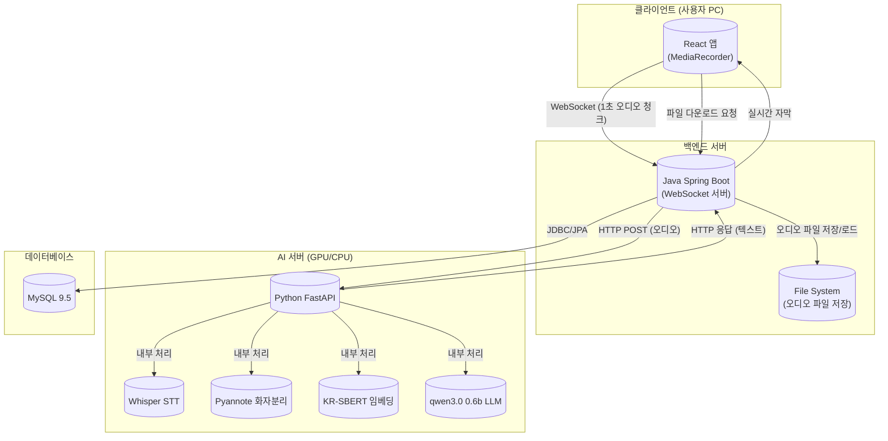
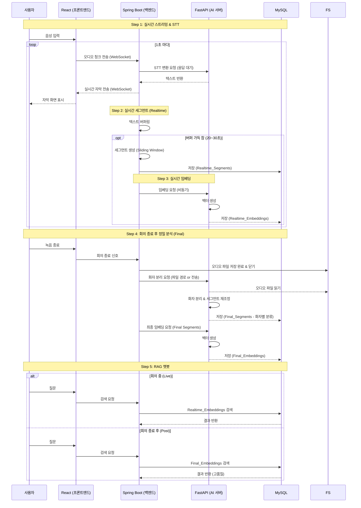
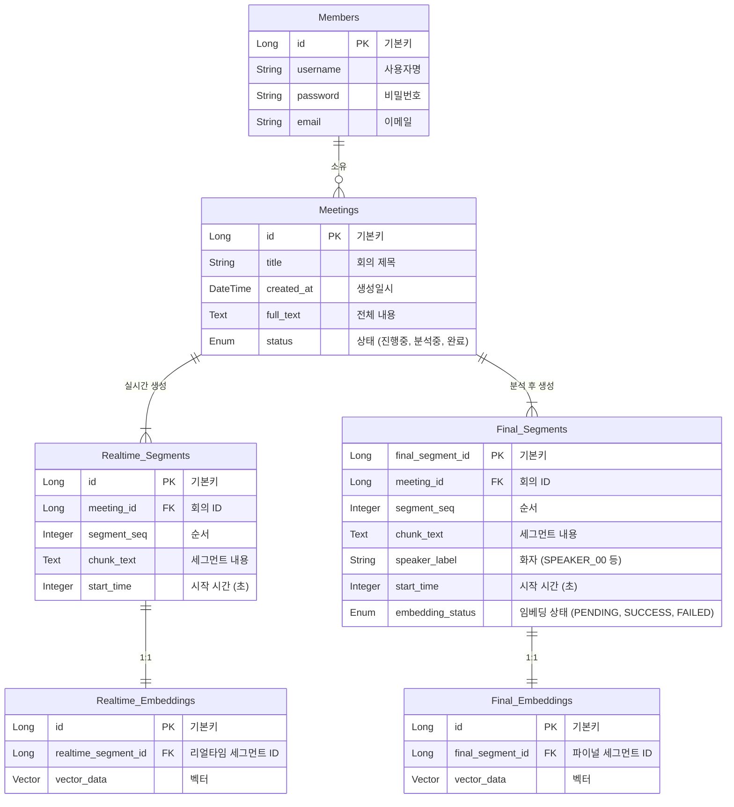

# 시스템 아키텍처 및 설계

이 문서는 AI 회의록 프로젝트의 시스템 아키텍처, 데이터 흐름, 그리고 데이터베이스 설계를 설명합니다.

## 1. 시스템 아키텍처 (System Architecture)

이 시스템은 React 프론트엔드, Java Spring Boot 백엔드, Python FastAPI AI 서버, 그리고 MySQL 데이터베이스로 구성됩니다.

---

## 2. 데이터 흐름 (Data Workflow)

### 실시간 스트리밍 & 처리 루프

1.  **스트리밍**: React가 오디오를 1초 단위로 수집하여 WebSocket으로 전송합니다.
2.  **STT (실시간 변환)**: Spring Boot가 이를 FastAPI(Whisper)로 전달하고, 변환된 텍스트를 받아 React로 반환합니다.
3.  **세그먼트 생성**: 반환된 텍스트는 Java 메모리 버퍼에 쌓이며, 문맥 유지를 위해 **30% 중첩(Overlap)**을 적용하여 세그먼트를 생성합니다.
4.  **저장 및 임베딩**: 생성된 세그먼트는 DB에 저장된 후, 비동기 이벤트로 임베딩(벡터화) 처리됩니다.

---

## 3. 데이터베이스 설계 (ERD)

