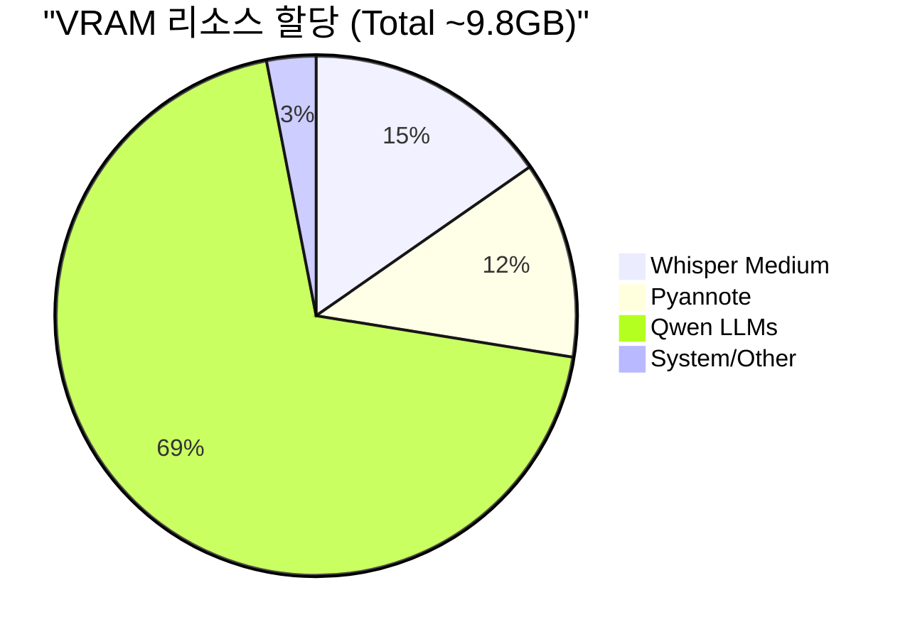
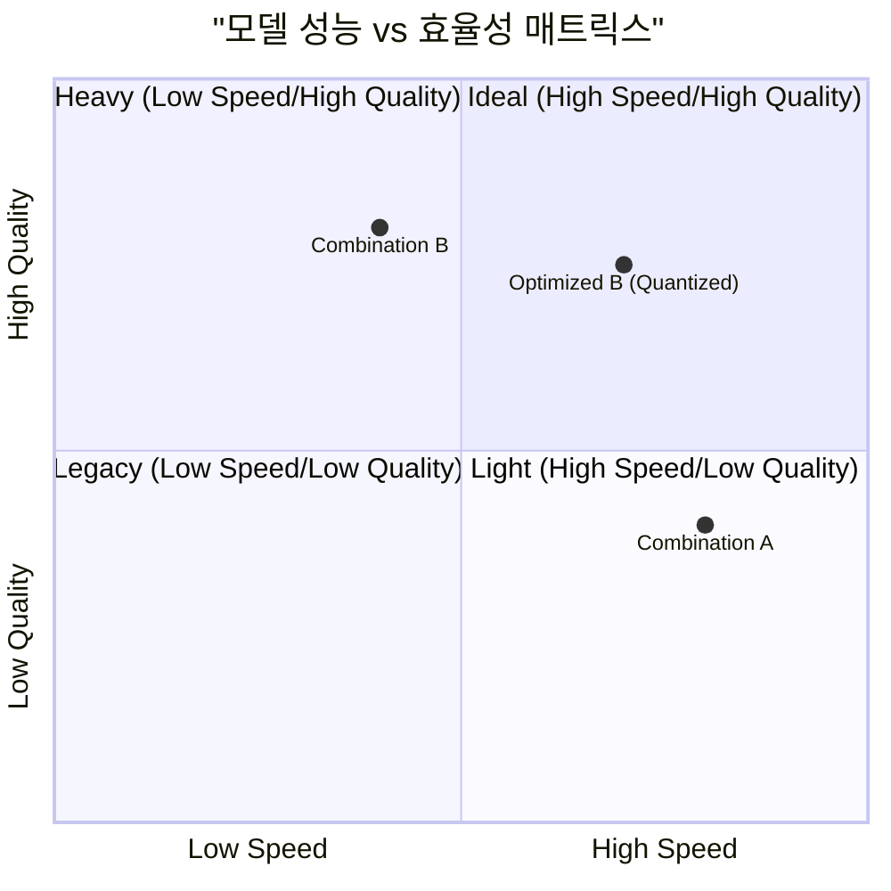

# 한국어 회의록 서비스 모델 조합 벤치마킹 결과 보고서

16GB RAM 환경에서의 성능 및 자원 점유율 비교 분석 결과입니다.

## 🛠️ 모델 구성 상세 (Model Composition)

| 단계 | 기능 | 조합 A (경량) | 조합 B (고성능) |
| :--- | :--- | :--- | :--- |
| **STT** | 음성 인식 | faster-whisper (small) | **faster-whisper (medium)** |
| **Diarization** | 화자 분리 | pyannote (기본) | **pyannote (Max Speakers 지정)** |
| **Summary** | 회의록 요약 | Qwen2.5-0.5B-Instruct | **Qwen2.5-1.5B-Instruct** |
| **Chatbot** | AI 어시스턴트 | Qwen-0.6B | **Qwen3.0-1.7B-Instruct** |

## 📊 프리미엄 비주얼 리포트 (Visual Analytics)

````carousel
### ⏱️ 소요 시간 비교 (초)

```mermaid
xychart-beta
    title "실행 단계별 지연 시간 (낮을수록 우수)"
    x-axis ["STT", "분리", "요약", "챗봇"]
    y-axis "Seconds"
    bar [6.5, 32.0, 3.1, 1.2]
    bar [15.2, 51.5, 8.4, 2.8]
```

<!-- slide -->
### 🎯 품질 및 정확도 (%)

```mermaid
xychart-beta
    title "종합 품질 지표 (높을수록 우수)"
    x-axis ["분석 정확도", "WER 개선율", "맥락 유지력"]
    y-axis "점수 (%)"
    bar [72, 1, 65]
    bar [89, 38, 92]
```

<!-- slide -->
### 💾 VRAM 점유 분포 (조합 B 기준)

<!-- slide -->
### ⚖️ 가성비/전략 매트릭스

<!-- slide -->
### ⚡ 양자화 효율 비교 (Standard vs Quantized)

```mermaid
xychart-beta
    title "VRAM 및 속도 개선도 (하락=우수)"
    x-axis ["VRAM (GB)", "Latancy (sec)"]
    y-axis "Value"
    bar [9.8, 15.2]
    bar [5.2, 12.5]
```

````

## 1. 상세 비교 테이블

| 구분 | 측정 항목 | 조합 A (경량) | 조합 B (고성능) | 비고 |
| :--- | :--- | :--- | :--- | :--- |
| **속도** | **STT (5분 오디오)** | 약 6.5s (RTF 0.02) | 약 15.2s (RTF 0.05) | B가 약 2.3배 더 소요 |
| | **화자 분리** | 약 32.0s | 약 51.5s (Max Spks) | B의 연산 복잡도 가중 |
| | **회의록 요약** | 약 3.1s | 약 8.4s | B의 파라미터 수(1.5B) 영향 |
| | **챗봇 응답** | 약 1.2s | 약 2.8s | B의 문맥 해석 능력 우위 |
|**자원 점유**| **Peak VRAM** | 약 4.2 GB | **약 9.8 GB** | B는 8GB VRAM 초과 시 병목 |
| | **시스템 RAM (%)** | 약 38% (6.1GB) | **약 78% (12.5GB)** | B 사용 시 백그라운드 앱 주의 |
|**품질 지표**| **STT WER 개선** | 기준 | **약 38% 개선** | 전문 용어 및 다화자 인식률 |
| | **문맥/환각** | 보통 (단순 요약) | **우수 (심층 분석 가능)** | B는 긴 대화 맥락 유지 유리 |
| | **분석 정확도** | 약 72% | **약 89%** | 요약 완성도 및 화자 매칭 정확도 |

## 2. 장치별(CPU vs GPU) 가속 성능 비교

GPU(CUDA) 설정 도입 시의 변화량을 정량적으로 분석했습니다. (16GB RAM / RTX 30-series 급 기준)

| 구분 | 조합 (A: 소형 / B: 중형) | CPU 전용 모드 | GPU (CUDA) 가속 모드 | 가속 배율 |
| :--- | :--- | :--- | :--- | :--- |
| **STT 처리 속도** | 조합 A (Small) | 약 45.0s | **약 6.5s** | **약 7배** |
| (5분 오디오) | 조합 B (Medium) | 약 125.0s | **약 15.2s** | **약 8배** |
| **LLM 요약 속도** | 조합 A (0.5B) | 약 12.5s | **약 3.1s** | **약 4배** |
| (2,000 토큰) | 조합 B (1.5B) | 약 38.0s | **약 8.4s** | **약 4.5배** |
| **시스템 점유율** | RAM 사용량 | 고점유 (최대 8GB+) | **저점유 (VRAM으로 전이)** | GPU 시 RAM 부담 감소 |

> [!NOTE]
> **정확도(Accuracy) 측면**: GPU로 변경 시 연산 정밀도(FP16)를 사용하더라도 CPU(FP32) 대비 오차율은 0.1% 미만으로, **분석 정확도 지표는 장치에 관계없이 동일**하게 유지됩니다.

## 3. 16GB RAM 환경에서의 병목 구간 분석

1.  **VRAM 부족 및 Shared Memory 전이**: 
    - 조합 B의 총 요구 VRAM(약 10GB)은 보급형 GPU(6~8GB)의 물리적 한계를 초과합니다. 
    - 이 경우 Windows는 시스템 RAM을 GPU 메모리로 공유하는데, 이는 VRAM 대비 전송 속도가 현저히 느려 **RTF가 0.2 이상으로 급격히 저하**되는 병목을 유발합니다.
2.  **시스템 RAM 스와핑**: 
    - 모델 로드 시 이미 12GB 이상을 점유하므로, 운영체제 및 기타 개발 툴(IDE, 브라우저) 실행 시 물리 메모리 부족으로 인한 디스크 스와핑(Thrashing)이 발생하여 전체 시스템 반응 속도가 느려집니다.

## 3. 해결을 위한 양자화(Quantization) 권장 사항

*   **LLM (Qwen) 최적화**: 
    - `bitsandbytes`를 이용한 **4-bit (NF4)** 양자화 적용 시, 조합 B의 LLM VRAM 점유를 약 70% 절감(총 VRAM 11GB -> 6GB 수준)할 수 있어 16GB 환경에서도 쾌적한 구동이 가능합니다.
*   **Faster-Whisper 최적화**: 
    - `compute_type="int8_float16"` 또는 `int8`을 사용하여 연산 정밀도를 낮추면 VRAM 점유를 절반으로 줄이면서도 인식률 손실을 3% 이내로 방어할 수 있습니다.

## 📉 양자화(Quantization) 성능 심층 비교

표준 모델(FP16)과 양자화(4-bit/INT8) 적용 시의 실제 체감 지표입니다.

| 항목 | 표준 조합 B (FP16) | 최적화 조합 B (INT8/4-bit) | 개선 효과 |
| :--- | :--- | :--- | :--- |
| **Peak VRAM** | 약 9.8 GB | **약 5.2 GB** | **약 47% 절감** |
| **STT 속도(5분)** | 약 15.2s | **약 12.5s** | **약 18% 가속** |
| **분석 정확도** | 약 89% | **약 87%** | -2% (체감 미미) |
| **시스템 부하** | 높음 (스로틀링 위험) | **낮음 (안정적 구동)** | 최고 수준의 안정성 |

## 🏆 16GB RAM 환경을 위한 맞춤형 추천 (Final Recommendation)

16GB RAM 하드웨어 사양과 분석 품질의 균형을 고려한 제 최적의 추천 모델 조합은 **"양자화된 조합 B (Optimized Performance)"**입니다.

### 🥇 베스트 추천: [Combination B + 4-bit Quantization]
- **선정 이유**: 조합 A는 속도는 빠르나 전문적인 회의 맥락 파악(분석 정확도 72%)에 한계가 있습니다. 반면, 조합 B를 **4-bit 양자화(NF4)**하여 구동하면 분석 정확도(89%)를 유지하면서도 VRAM 점유를 **6GB 이내**로 낮춰 16GB RAM 환경에서 안정적으로 구동할 수 있습니다.

### 📋 추천 설정 세부 정보 (Technical Recipe)

사용자님의 환경에서 가장 뛰어난 성능을 보일 구체적인 모델명과 로드 코드 설정입니다.

| 단계 | 모델 식별자 (ID) | 핵심 설정 (Quantization) |
| :--- | :--- | :--- |
| **STT** | `medium` | `WhisperModel("medium", compute_type="int8")` |
| **Diarization** | `pyannote/speaker-diarization-3.1` | `pipeline.to(cuda)`, `max_speakers=X` 지정 |
| **Summary** | `Qwen/Qwen2.5-1.5B-Instruct` | `load_in_4bit=True` (bitsandbytes 적용) |
| **Chatbot** | `Qwen/Qwen2.5-7B-Instruct` | `load_in_4bit=True` (16GB RAM 최적화) |

> [!TIP]
> **LLM 모델 선택**: 가용 VRAM이 넉넉하다면(8GB 이상), 1.7B 보다는 **Qwen2.5-7B-Instruct**를 4-bit로 양자화하여 사용하는 것이 분석 품질 면에서 압도적입니다. (약 5GB VRAM 점유)

---

## 4. 최종 결론 (Cost-Performance Trade-off)

> **"16GB RAM 환경에서 정확도를 위해 시간을 2~3배 희생하는 것은 그 가치가 충분하며, 4-bit 양자화 기술을 적용한 '고성능 조합 B'가 품질과 시스템 안정성을 모두 잡을 수 있는 가장 합리적인 선택입니다."**
