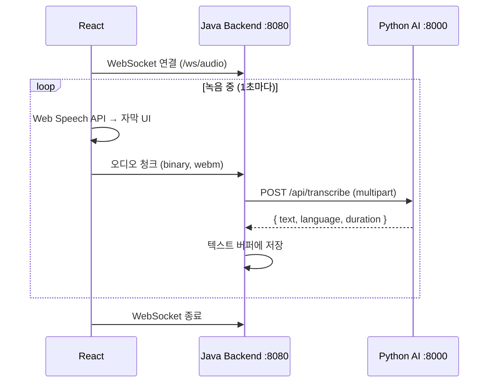

# 1단계: 실시간 오디오 스트리밍 구현 계획

## 목표
React에서 1초 단위로 오디오 청크를 추출하여 WebSocket으로 Java Backend에 전송하고, Backend에서 Python AI Whisper API를 호출하여 텍스트로 변환합니다.

## 아키텍처



---

## 환경 변수 설정 (로컬/배포 전환)

### Frontend (.env 파일)

```bash
# .env.local (로컬 개발용)
VITE_JAVA_API_URL=http://localhost:8080
VITE_JAVA_WS_URL=ws://localhost:8080
VITE_PYTHON_API_URL=http://localhost:8000

# .env.production (배포용 - Netlify 환경 변수로 설정)
VITE_JAVA_API_URL=https://your-java-ngrok-url.ngrok.io
VITE_JAVA_WS_URL=wss://your-java-ngrok-url.ngrok.io
VITE_PYTHON_API_URL=https://your-python-ngrok-url.ngrok.io
```

### Java Backend (application.properties)

```properties
# application.properties (기본 - 로컬)
python.ai.url=http://localhost:8000
cors.allowed-origins=http://localhost:5173,http://localhost:3000

# application-prod.properties (배포용)
python.ai.url=https://your-python-ngrok-url.ngrok.io
cors.allowed-origins=https://your-netlify-url.netlify.app
```

### 사용 방법

| 환경 | Frontend | Backend |
|------|----------|---------|
| **로컬** | `npm run dev` | `./gradlew bootRun` |
| **배포** | Netlify (환경 변수 설정) | `--spring.profiles.active=prod` |

---

## Proposed Changes

### Java Backend

#### [MODIFY] [build.gradle](file:///c:/dev/AI/AI-5-mini-project/backend/build.gradle)
```diff
dependencies {
    // 기존 의존성...
+   implementation 'org.springframework.boot:spring-boot-starter-websocket'
+   implementation 'org.springframework.boot:spring-boot-starter-webflux'
}
```

---

#### [NEW] [WebSocketConfig.java](file:///c:/dev/AI/AI-5-mini-project/backend/src/main/java/com/minipr/backend/websocket/WebSocketConfig.java)

WebSocket 엔드포인트 및 CORS 설정:
- 엔드포인트: `/ws/audio`
- 허용 Origin: `localhost:5173`, `localhost:3000`

```java
@Configuration
@EnableWebSocket
public class WebSocketConfig implements WebSocketConfigurer {
    @Override
    public void registerWebSocketHandlers(WebSocketHandlerRegistry registry) {
        registry.addHandler(audioWebSocketHandler(), "/ws/audio")
                .setAllowedOrigins("http://localhost:5173", "http://localhost:3000");
    }
    
    @Bean
    public AudioWebSocketHandler audioWebSocketHandler() {
        return new AudioWebSocketHandler(whisperApiClient());
    }
    
    @Bean
    public WhisperApiClient whisperApiClient() {
        return new WhisperApiClient();
    }
}
```

---

#### [NEW] [AudioWebSocketHandler.java](file:///c:/dev/AI/AI-5-mini-project/backend/src/main/java/com/minipr/backend/websocket/AudioWebSocketHandler.java)

바이너리 오디오 수신 및 Whisper API 호출:

```java
@Slf4j
public class AudioWebSocketHandler extends BinaryWebSocketHandler {
    private final WhisperApiClient whisperApiClient;
    
    @Override
    protected void handleBinaryMessage(WebSocketSession session, BinaryMessage message) {
        byte[] audioData = message.getPayload().array();
        log.info("오디오 청크 수신: {} bytes", audioData.length);
        
        // Whisper API 호출
        whisperApiClient.transcribe(audioData)
            .subscribe(response -> {
                log.info("Whisper 응답: {}", response.getText());
                // TODO: 버퍼에 텍스트 저장 (3단계에서 구현)
            });
    }
}
```

---

#### [NEW] [WhisperApiClient.java](file:///c:/dev/AI/AI-5-mini-project/backend/src/main/java/com/minipr/backend/websocket/WhisperApiClient.java)

Python AI 서버 호출:

```java
@Component
public class WhisperApiClient {
    private final WebClient webClient;
    
    public WhisperApiClient() {
        this.webClient = WebClient.builder()
            .baseUrl("http://localhost:8000")
            .build();
    }
    
    public Mono<TranscribeResponse> transcribe(byte[] audioData) {
        MultipartBodyBuilder builder = new MultipartBodyBuilder();
        builder.part("file", new ByteArrayResource(audioData) {
            @Override
            public String getFilename() {
                return "audio_" + System.currentTimeMillis() + ".webm";
            }
        });
        
        return webClient.post()
            .uri("/api/transcribe")
            .contentType(MediaType.MULTIPART_FORM_DATA)
            .body(BodyInserters.fromMultipartData(builder.build()))
            .retrieve()
            .bodyToMono(TranscribeResponse.class);
    }
}
```

---

#### [NEW] [TranscribeResponse.java](file:///c:/dev/AI/AI-5-mini-project/backend/src/main/java/com/minipr/backend/websocket/TranscribeResponse.java)

Whisper API 응답 DTO:

```java
@Data
public class TranscribeResponse {
    private String text;
    private String language;
    private double duration;
    private int tookMs;
}
```

---

### Frontend

#### [MODIFY] [LiveSttPage.tsx](file:///c:/dev/AI/AI-5-mini-project/frontend/src/liveStt/LiveSttPage.tsx)

WebSocket 연결 및 1초마다 오디오 전송:

```typescript
// 추가할 상태 및 ref
const wsRef = useRef<WebSocket | null>(null);
const audioIntervalRef = useRef<NodeJS.Timeout | null>(null);

// WebSocket 연결 함수
const connectWebSocket = () => {
    const ws = new WebSocket('ws://localhost:8080/ws/audio');
    ws.binaryType = 'arraybuffer';
    
    ws.onopen = () => console.log('WebSocket 연결됨');
    ws.onclose = () => console.log('WebSocket 종료됨');
    ws.onerror = (e) => console.error('WebSocket 오류:', e);
    
    wsRef.current = ws;
};

// 1초마다 오디오 전송
const startAudioStreaming = () => {
    audioIntervalRef.current = setInterval(() => {
        if (mediaRecorderRef.current && wsRef.current?.readyState === WebSocket.OPEN) {
            // MediaRecorder에서 1초 청크 추출 후 전송
            mediaRecorderRef.current.requestData();
        }
    }, 1000);
};

// MediaRecorder ondataavailable 수정
mediaRecorder.ondataavailable = (event) => {
    if (event.data.size > 0 && wsRef.current?.readyState === WebSocket.OPEN) {
        wsRef.current.send(event.data);  // WebSocket으로 전송
    }
};
```

---

## 생성할 파일 목록

| 위치 | 파일 | 설명 |
|------|------|------|
| Frontend | `.env.local` | 로컬 환경 변수 |
| Frontend | `LiveSttPage.tsx` | WebSocket 연결 추가 |
| Backend | `build.gradle` | 의존성 추가 |
| Backend | `application.properties` | Python AI URL 설정 추가 |
| Backend | `websocket/WebSocketConfig.java` | WebSocket 설정 |
| Backend | `websocket/AudioWebSocketHandler.java` | 오디오 수신 핸들러 |
| Backend | `websocket/WhisperApiClient.java` | Python API 클라이언트 |
| Backend | `websocket/TranscribeResponse.java` | 응답 DTO |

---

## Verification Plan

### 테스트 순서
1. Python AI 서버 실행 (`uvicorn app.main:app --reload`)
2. Java Backend 실행 (`./gradlew bootRun`)
3. Frontend 실행 (`npm run dev`)
4. 브라우저에서 마이크 버튼 클릭
5. **확인 사항:**
   - Java 콘솔: `오디오 청크 수신: XXX bytes` 로그
   - Java 콘솔: `Whisper 응답: 텍스트...` 로그
   - 브라우저 Network 탭: WebSocket 연결 확인
