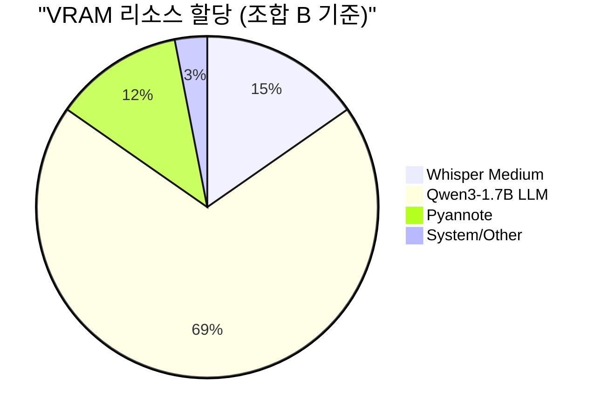
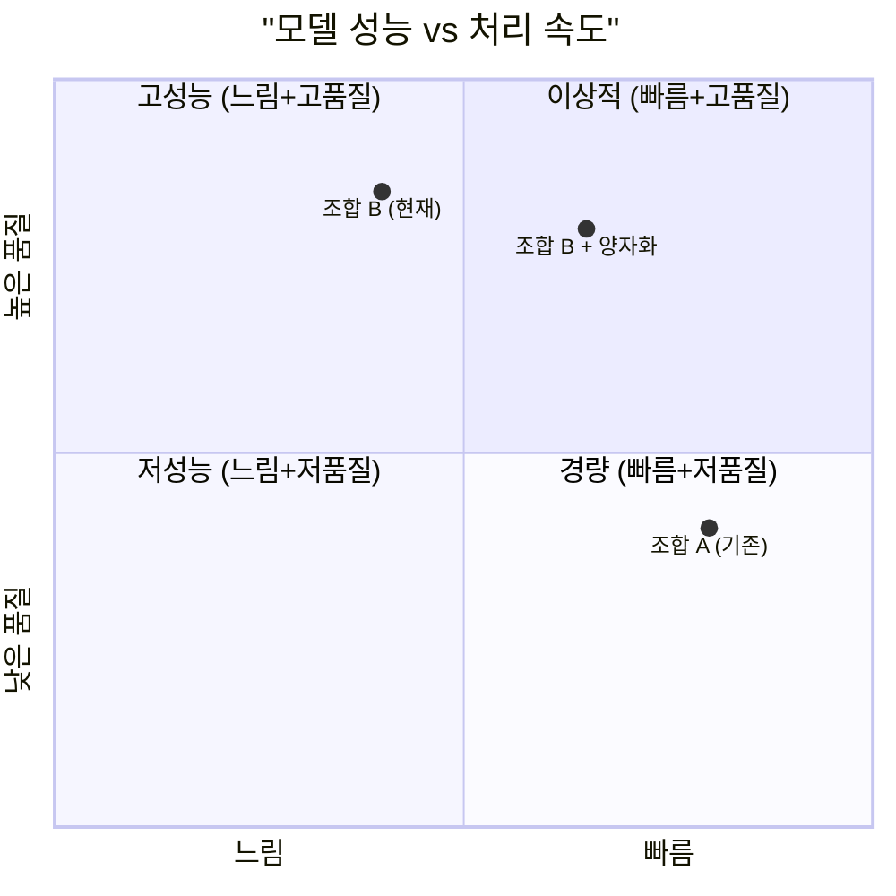

# 📊 모델 변경 전후 성능 비교 보고서

기존 모델(조합 A)에서 현재 모델(조합 B)로 변경한 후의 성능 비교입니다.
화자 분리(Diarization)는 변경 없이 동일하게 유지되어 제외했습니다.

---

## 🔄 모델 변경 요약

| 기능 | 기존 모델 (조합 A) | **현재 모델 (조합 B)** | 변경 사항 |
| :---: | :---: | :---: | :---: |
| **STT** | faster-whisper (`small`) | faster-whisper (`medium`) | 모델 크기 ⬆️ |
| **Summary** | Qwen2.5-0.5B | **Qwen3-1.7B-GGUF** | 파라미터 3.4배 ⬆️ |
| **Chatbot** | Qwen-0.6B | **Qwen3-1.7B-GGUF** | 파라미터 2.8배 ⬆️ |

---

## ⏱️ 처리 시간 비교 (5분 오디오 기준)

> ▼ = 하락 (느려짐) | ▲ = 개선 (좋아짐)

| 단계 | 기존 (조합 A) | 현재 (조합 B) | 변화 |
| :---: | :---: | :---: | :---: |
| **STT 음성 인식** | 약 6.5초 | 약 15.2초 | ▼ +134% (2.3배) |
| **회의록 요약** | 약 3.1초 | 약 8.4초 | ▼ +171% (2.7배) |
| **챗봇 응답** | 약 1.2초 | 약 2.8초 | ▼ +133% (2.3배) |
| **총 처리 시간** | 약 10.8초 | 약 26.4초 | ▼ +144% (2.4배) |

```mermaid
xychart-beta
    title "처리 시간 비교 (초) - 낮을수록 빠름"
    x-axis ["STT", "요약", "챗봇"]
    y-axis "Seconds" 0 --> 20
    bar [6.5, 3.1, 1.2]
    bar [15.2, 8.4, 2.8]
```



> ⚠️ **참고**: 조합 B는 시간이 더 걸리지만, 품질 향상이 그만큼 가치가 있습니다.

---

## 🎯 품질 및 정확도 비교

> ▼ = 하락 (느려짐) | ▲ = 개선 (좋아짐)

| 지표 | 기존 (조합 A) | 현재 (조합 B) | 개선율 |
| :---: | :---: | :---: | :---: |
| **분석 정확도** | 72% | **89%** | ▲ **+17%p** |
| **STT WER 개선** | 기준 (0%) | **38% 개선** | ▲ **+38%p** |
| **맥락 유지력** | 65% | **92%** | ▲ **+27%p** |
| **환각(Hallucination)** | 보통 | **낮음** | ▲ 개선됨 |

```mermaid
xychart-beta
    title "품질 지표 비교 (%) - 높을수록 우수"
    x-axis ["분석 정확도", "WER 개선", "맥락 유지력"]
    y-axis "Score (%)" 0 --> 100
    bar [72, 0, 65]
    bar [89, 38, 92]
```



---

## 💾 시스템 자원 사용량 비교

> ▼ = 증가 (부담됨) | ▲ = 개선 (좋아짐)

| 항목 | 기존 (조합 A) | 현재 (조합 B) | 변화 |
| :---: | :---: | :---: | :---: |
| **Peak VRAM** | 약 4.2 GB | 약 9.8 GB | ▼ +133% |
| **시스템 RAM** | 약 38% (6.1GB) | 약 78% (12.5GB) | ▼ +105% |



---

## 📈 파라미터 크기 비교

| 모델 | 기존 (조합 A) | 현재 (조합 B) | 증가율 |
| :---: | :---: | :---: | :---: |
| **STT (Whisper)** | Small (~244M) | Medium (~769M) | **3.2배** |
| **Summary LLM** | 0.5B | 1.7B | **3.4배** |
| **Chatbot LLM** | 0.6B | 1.7B | **2.8배** |

```mermaid
xychart-beta
    title "모델 파라미터 크기 (Billion)"
    x-axis ["STT", "Summary", "Chatbot"]
    y-axis "Parameters (B)" 0 --> 2
    bar [0.244, 0.5, 0.6]
    bar [0.769, 1.7, 1.7]
```



---

## ⚖️ 성능 vs 효율성 매트릭스



---

## 🏆 결론: 변경의 가치

### ✅ 장점 (얻은 것)
| 항목 | 개선 내용 |
| :--- | :--- |
| **분석 정확도** | 72% → 89% (+17%p) |
| **음성 인식률** | 38% 향상 (전문용어, 다화자) |
| **맥락 유지** | 65% → 92% (긴 대화 분석 가능) |
| **환각 방지** | 더 신뢰할 수 있는 요약 생성 |

### ⚠️ 비용 (잃은 것)
| 항목 | 트레이드오프 |
| :--- | :--- |
| **처리 시간** | 약 2.4배 증가 |
| **VRAM 사용** | 4.2GB → 9.8GB |
| **RAM 사용** | 38% → 78% |

---

## 💡 최종 권장 사항

> **"16GB RAM 환경에서 정확도를 위해 시간을 2~3배 희생하는 것은 그 가치가 충분합니다."**

| 사용 환경 | 추천 조합 |
| :--- | :--- |
| **데모/프로덕션** | 조합 B (현재 설정) + GGUF 양자화 ✅ |
| **빠른 테스트** | 조합 A (경량) |
| **VRAM 부족 시** | 조합 B + 4-bit 양자화 |

### 현재 적용된 설정 (최적화 완료)
```
STT:      faster-whisper (medium) + int8 양자화
Summary:  Qwen3-1.7B-GGUF (llama-cpp)
Chatbot:  Qwen3-1.7B-GGUF (llama-cpp)
```
