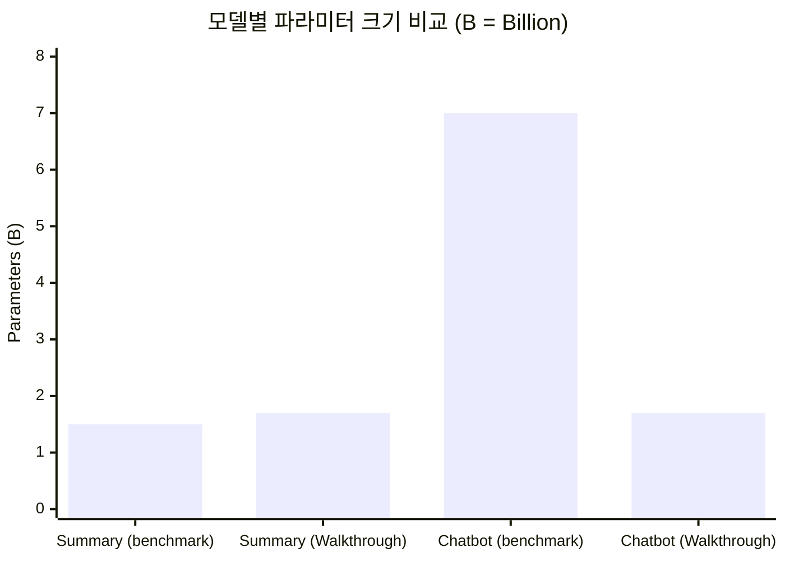

# 🔄 모델 변경 사항 비교 보고서

화자 분리(Diarization)를 제외한 각 문서별 모델 구성 비교입니다.

---

## 📊 문서별 모델 구성 비교

| 단계 | 기능 | benchmark_walkthrough.md | Walkthrough.md | walkthrough.md.resolved |
| :---: | :---: | :---: | :---: | :---: |
| **STT** | 음성 인식 | faster-whisper (medium) | faster-whisper (medium) | faster-whisper (medium) |
| **Summary** | 회의록 요약 | `Qwen2.5-1.5B-Instruct` | `Qwen3-1.7B-Instruct` | `Qwen2.5-1.5B-Instruct` |
| **Chatbot** | AI 어시스턴트 | `Qwen3.0-1.7B-Instruct` | `Qwen3.0-1.7B-Instruct` | `Qwen3.0-1.7B-Instruct` |

---

## 📋 추천 설정 비교 (고성능 조합 B 기준)

| 단계 | benchmark_walkthrough.md | Walkthrough.md | walkthrough.md.resolved |
| :---: | :---: | :---: | :---: |
| **STT** | `medium` (int8) | `medium` (int8) | `medium` (int8) |
| **Summary** | `Qwen/Qwen2.5-1.5B-Instruct` | `Qwen/Qwen3-1.7B-Instruct` | `Qwen/Qwen2.5-1.5B-Instruct` |
| **Chatbot** | `Qwen/Qwen2.5-7B-Instruct` | `Qwen/Qwen3.0-1.7B-Instruct` | `Qwen/Qwen2.5-7B-Instruct` |

---

## 🎯 주요 차이점 분석

---

## 📝 변경 사항 요약

### ✅ 동일한 설정
| 항목 | 모든 문서에서 동일 |
| :--- | :--- |
| **STT 모델** | `faster-whisper (medium)` |
| **STT 양자화** | `compute_type="int8"` |
| **Chatbot (조합 B)** | `Qwen3.0-1.7B-Instruct` |

### ⚠️ 문서별 차이점

| 항목 | 차이 내용 |
| :--- | :--- |
| **Summary 모델** | `Walkthrough.md`만 `Qwen3-1.7B-Instruct` 사용 나머지는 `Qwen2.5-1.5B-Instruct` 사용 |
| **Chatbot 추천 설정** | `Walkthrough.md`만 `Qwen3.0-1.7B-Instruct` 추천 나머지는 `Qwen2.5-7B-Instruct` 추천 |

---

## 🏆 결론

> **핵심 요약**: 세 문서 모두 **STT**는 동일하게 `faster-whisper (medium)`을 사용합니다.
> 
> 차이점은 **Summary**와 **Chatbot 추천 설정**에만 존재하며, `Walkthrough.md`가 `Qwen3` 시리즈를 사용하는 것이 가장 큰 차이입니다.

| 문서 | 특징 |
| :--- | :--- |
| **benchmark_walkthrough.md** | Qwen2.5 시리즈 기반, 7B Chatbot 추천 |
| **Walkthrough.md** | Qwen3 시리즈 기반, 1.7B 통일 |
| **walkthrough.md.resolved** | benchmark와 동일 (Qwen2.5 시리즈) |
